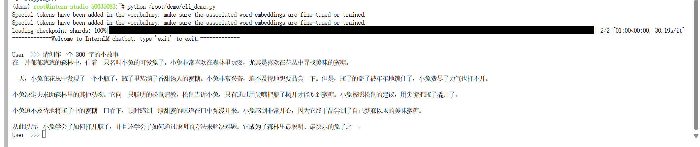
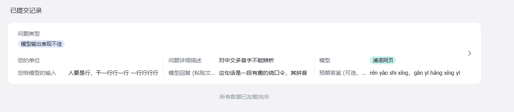
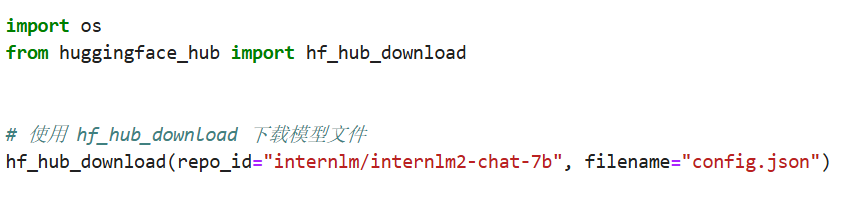
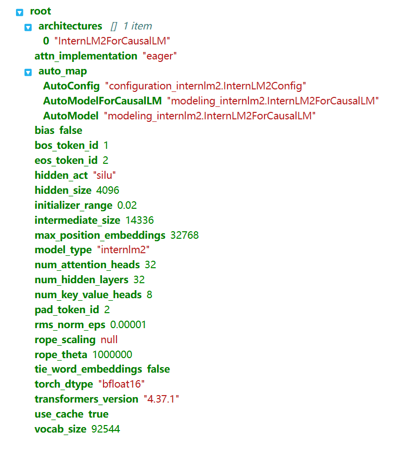
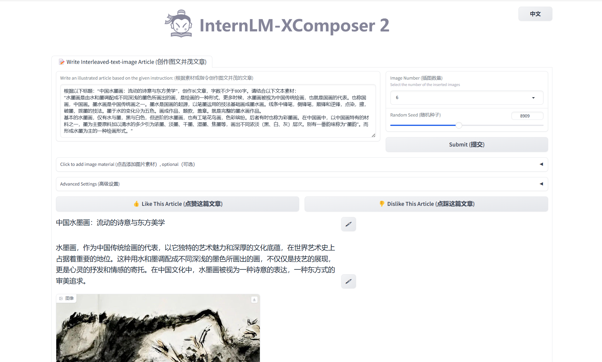
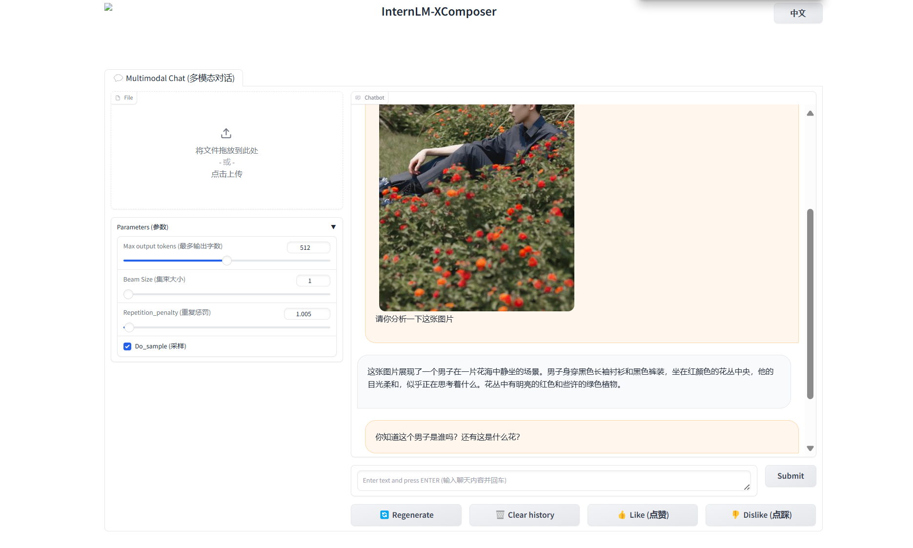
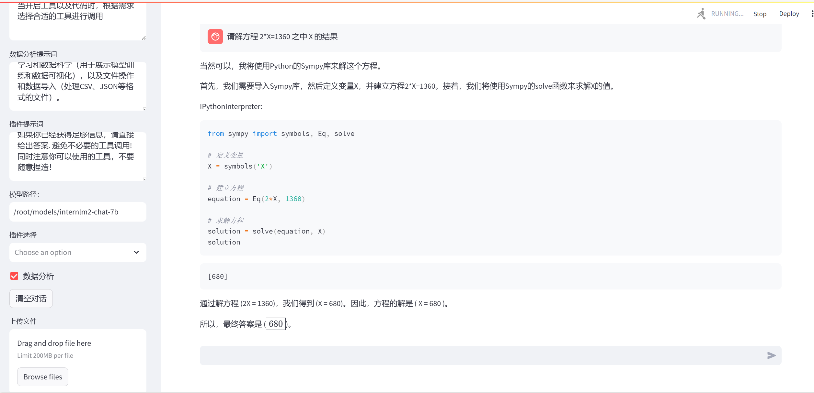

# 一、基础作业
## 1.1、使用 InternLM2-Chat-1.8B 模型生成 300 字的小故事（需截图）
- 在`/root/demo/download_mini.py`文件里输入如下代码：
```
import os
from modelscope.hub.snapshot_download import snapshot_download

# 创建保存模型目录
os.system("mkdir /root/models")

# save_dir是模型保存到本地的目录
save_dir="/root/models"

snapshot_download("Shanghai_AI_Laboratory/internlm2-chat-1_8b", 
                  cache_dir=save_dir, 
                  revision='v1.1.0')
```
运行`python /root/demo/download_mini.py`
- 在`/root/demo/cli_demo.py`文件里输入如下代码：
```
import torch
from transformers import AutoTokenizer, AutoModelForCausalLM


model_name_or_path = "/root/models/Shanghai_AI_Laboratory/internlm2-chat-1_8b"

tokenizer = AutoTokenizer.from_pretrained(model_name_or_path, trust_remote_code=True, device_map='cuda:0')
model = AutoModelForCausalLM.from_pretrained(model_name_or_path, trust_remote_code=True, torch_dtype=torch.bfloat16, device_map='cuda:0')
model = model.eval()

system_prompt = """You are an AI assistant whose name is InternLM (书生·浦语).
- InternLM (书生·浦语) is a conversational language model that is developed by Shanghai AI Laboratory (上海人工智能实验室). It is designed to be helpful, honest, and harmless.
- InternLM (书生·浦语) can understand and communicate fluently in the language chosen by the user such as English and 中文.
"""

messages = [(system_prompt, '')]

print("=============Welcome to InternLM chatbot, type 'exit' to exit.=============")

while True:
    input_text = input("\nUser  >>> ")
    input_text = input_text.replace(' ', '')
    if input_text == "exit":
        break

    length = 0
    for response, _ in model.stream_chat(tokenizer, input_text, messages):
        if response is not None:
            print(response[length:], flush=True, end="")
            length = len(response)

```
运行
```
conda activate demo
python /root/demo/cli_demo.py
```
- 结果


## 1.2、使用书生·浦语 Web 和浦语对话，和书生·浦语对话，并找到书生·浦语 1 处表现不佳的案例(比如指令遵循表现不佳的案例)，提交到问卷


## 1.3、部署实战营优秀作品 八戒-Chat-1.8B 模型
-下载模型代码，`git clone https://gitee.com/InternLM/Tutorial`
- 在 Web IDE 中执行 bajie_download.py：`python /root/Tutorial/helloworld/bajie_download.py`
- 待程序下载完成后，输入运行命令：`streamlit run /root/Tutorial/helloworld/bajie_chat.py --server.address 127.0.0.1 --server.port 6006`
- 待程序运行的同时，对端口环境配置本地 PowerShell 。使用快捷键组合 Windows + R（Windows 即开始菜单键）打开指令界面，并输入命令，按下回车键。（Mac 用户打开终端即可）
- 打开 PowerShell 后，先查询端口，再根据端口键入命令 （例如图中端口示例为 38374）：
  ```
  # 从本地使用 ssh 连接 studio 端口
  # 将下方端口号 38374 替换成自己的端口号
  ssh -CNg -L 6006:127.0.0.1:6006 root@ssh.intern-ai.org.cn -p 38374
  ```
- 再复制下方的密码，输入到 password 中，直接回车
- 打开 http://127.0.0.1:6006 后，等待加载完成即可进行对话
结果如下：
  

# 二、进阶作业
## 2.1熟悉 huggingface 下载功能，使用 huggingface_hub python 包，下载 InternLM2-Chat-7B 的 config.json 文件到本地（需截图下载过程）
- 下载代码
  


- config.json文件
  

## 2.2完成 浦语·灵笔2 的 图文创作 及 视觉问答 部署（需截图）
### 2.2.1初步介绍 XComposer2 相关知识
浦语·灵笔2 是基于 书生·浦语2 大语言模型研发的突破性的图文多模态大模型，具有非凡的图文写作和图像理解能力，在多种应用场景表现出色，总结起来其具有：

自由指令输入的图文写作能力： 浦语·灵笔2 可以理解自由形式的图文指令输入，包括大纲、文章细节要求、参考图片等，为用户打造图文并貌的专属文章。生成的文章文采斐然，图文相得益彰，提供沉浸式的阅读体验。
准确的图文问题解答能力：浦语·灵笔2 具有海量图文知识，可以准确的回复各种图文问答难题，在识别、感知、细节描述、视觉推理等能力上表现惊人。
杰出的综合能力： 浦语·灵笔2-7B 基于 书生·浦语2-7B 模型，在13项多模态评测中大幅领先同量级多模态模型，在其中6项评测中超过 GPT-4V 和 Gemini Pro。
###  2.2.2配置基础环境（开启 50% A100 权限后才可开启此章节）
- 进入开发机，启动 conda 环境：
```
conda activate demo
# 补充环境包
pip install timm==0.4.12 sentencepiece==0.1.99 markdown2==2.4.10 xlsxwriter==3.1.2 gradio==4.13.0 modelscope==1.9.5
```
- 下载 InternLM-XComposer 仓库 相关的代码资源：
```
cd /root/demo
git clone https://gitee.com/internlm/InternLM-XComposer.git
# git clone https://github.com/internlm/InternLM-XComposer.git
cd /root/demo/InternLM-XComposer
git checkout f31220eddca2cf6246ee2ddf8e375a40457ff626
```
- 在 terminal 中输入指令，构造软链接快捷访问方式：
```
ln -s /root/share/new_models/Shanghai_AI_Laboratory/internlm-xcomposer2-7b /root/models/internlm-xcomposer2-7b
ln -s /root/share/new_models/Shanghai_AI_Laboratory/internlm-xcomposer2-vl-7b /root/models/internlm-xcomposer2-vl-7b
```
### 2.2.3图文写作实战（开启 50% A100 权限后才可开启此章节）
- 继续输入指令，用于启动 InternLM-XComposer：
```
cd /root/demo/InternLM-XComposer
python /root/demo/InternLM-XComposer/examples/gradio_demo_composition.py  \
--code_path /root/models/internlm-xcomposer2-7b \
--private \
--num_gpus 1 \
--port 6006
```
- 结果如下：



### 2.2.4图片理解实战（开启 50% A100 权限后才可开启此章节）
- 关闭终端并重新启动一个新的 terminal，继续输入指令，启动 InternLM-XComposer2-vl：
```
conda activate demo

cd /root/demo/InternLM-XComposer
python /root/demo/InternLM-XComposer/examples/gradio_demo_chat.py  \
--code_path /root/models/internlm-xcomposer2-vl-7b \
--private \
--num_gpus 1 \
--port 6006
```
- 结果如下：


## 2.3完成 Lagent 工具调用 数据分析 Demo 部署（需截图）
### 2.3.1初步介绍 Lagent 相关知识
Lagent 是一个轻量级、开源的基于大语言模型的智能体（agent）框架，支持用户快速地将一个大语言模型转变为多种类型的智能体，并提供了一些典型工具为大语言模型赋能。它的整个框架图如下:


Lagent 的特性总结如下：

- 流式输出：提供 stream_chat 接口作流式输出，本地就能演示酷炫的流式 Demo。
- 接口统一，设计全面升级，提升拓展性，包括：
  - Model : 不论是 OpenAI API, Transformers 还是推理加速框架 LMDeploy 一网打尽，模型切换可以游刃有余；
  - Action: 简单的继承和装饰，即可打造自己个人的工具集，不论 InternLM 还是 GPT 均可适配；
  - Agent：与 Model 的输入接口保持一致，模型到智能体的蜕变只需一步，便捷各种 agent 的探索实现；
- 文档全面升级，API 文档全覆盖。
### 2.3.2配置基础环境（开启 30% A100 权限后才可开启此章节）
- 使用 git 命令下载 Lagent 相关的代码库：
```
git clone https://gitee.com/internlm/lagent.git
# git clone https://github.com/internlm/lagent.git
cd /root/demo/lagent
git checkout 581d9fb8987a5d9b72bb9ebd37a95efd47d479ac
pip install -e . # 源码安装
```
### 2.3.3使用 Lagent 运行 InternLM2-Chat-7B 模型为内核的智能体
Intern Studio 在 share 文件中预留了实践章节所需要的所有基础模型，包括 InternLM2-Chat-7b 、InternLM2-Chat-1.8b 等等。我们可以在后期任务中使用 share 文档中包含的资源，但是在本章节，为了能让大家了解各类平台使用方法，还是推荐同学们按照提示步骤进行实验。
- 打开 lagent 路径：`cd /root/demo/lagent`
- 在 terminal 中输入指令，构造软链接快捷访问方式：`ln -s /root/share/new_models/Shanghai_AI_Laboratory/internlm2-chat-7b /root/models/internlm2-chat-7b`
- 打开 lagent 路径下 examples/internlm2_agent_web_demo_hf.py 文件，并修改对应位置 (71行左右) 代码：`value='/root/models/internlm2-chat-7b'`
- 输入运行命令 - 点开 6006 链接后，大约需要 5 分钟完成模型加载：
  `streamlit run /root/demo/lagent/examples/internlm2_agent_web_demo_hf.py --server.address 127.0.0.1 --server.port 6006`
- 待程序运行的同时，对本地端口环境配置本地 PowerShell 。使用快捷键组合 Windows + R（Windows 即开始菜单键）打开指令界面，并输入命令，按下回车键。（Mac 用户打开终端即可）
- 打开 PowerShell 后，先查询端口，再根据端口键入命令 （例如图中端口示例为 38374）
```
  # 从本地使用 ssh 连接 studio 端口
  # 将下方端口号 38374 替换成自己的端口号
  ssh -CNg -L 6006:127.0.0.1:6006 root@ssh.intern-ai.org.cn -p 38374
```
- 再复制下方的密码，输入到 password 中，直接回车
- 打开 http://127.0.0.1:6006 后，（会有较长的加载时间）勾上数据分析，其他的选项不要选择，进行计算方面的 Demo 对话，即完成本章节实战。
- 结果
  


  
