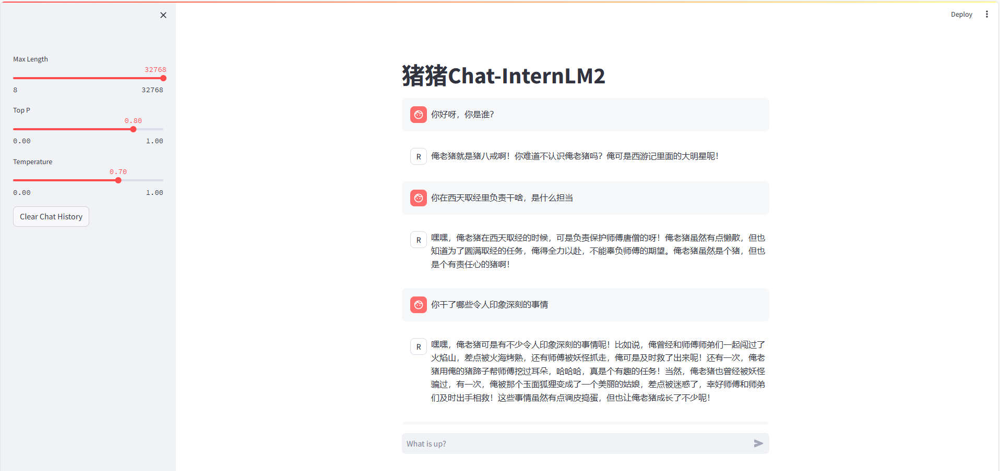

# 一、基础作业
## 1、使用 InternLM2-Chat-1.8B 模型生成 300 字的小故事（需截图）
- 在`/root/demo/download_mini.py`文件里输入如下代码：
```
import os
from modelscope.hub.snapshot_download import snapshot_download

# 创建保存模型目录
os.system("mkdir /root/models")

# save_dir是模型保存到本地的目录
save_dir="/root/models"

snapshot_download("Shanghai_AI_Laboratory/internlm2-chat-1_8b", 
                  cache_dir=save_dir, 
                  revision='v1.1.0')
```
运行`python /root/demo/download_mini.py`
- 在`/root/demo/cli_demo.py`文件里输入如下代码：
```
import torch
from transformers import AutoTokenizer, AutoModelForCausalLM


model_name_or_path = "/root/models/Shanghai_AI_Laboratory/internlm2-chat-1_8b"

tokenizer = AutoTokenizer.from_pretrained(model_name_or_path, trust_remote_code=True, device_map='cuda:0')
model = AutoModelForCausalLM.from_pretrained(model_name_or_path, trust_remote_code=True, torch_dtype=torch.bfloat16, device_map='cuda:0')
model = model.eval()

system_prompt = """You are an AI assistant whose name is InternLM (书生·浦语).
- InternLM (书生·浦语) is a conversational language model that is developed by Shanghai AI Laboratory (上海人工智能实验室). It is designed to be helpful, honest, and harmless.
- InternLM (书生·浦语) can understand and communicate fluently in the language chosen by the user such as English and 中文.
"""

messages = [(system_prompt, '')]

print("=============Welcome to InternLM chatbot, type 'exit' to exit.=============")

while True:
    input_text = input("\nUser  >>> ")
    input_text = input_text.replace(' ', '')
    if input_text == "exit":
        break

    length = 0
    for response, _ in model.stream_chat(tokenizer, input_text, messages):
        if response is not None:
            print(response[length:], flush=True, end="")
            length = len(response)

```
运行
```
conda activate demo
python /root/demo/cli_demo.py
```
- 结果


## 2、使用书生·浦语 Web 和浦语对话，和书生·浦语对话，并找到书生·浦语 1 处表现不佳的案例(比如指令遵循表现不佳的案例)，提交到问卷


## 3、部署实战营优秀作品 八戒-Chat-1.8B 模型
-下载模型代码，`git clone https://gitee.com/InternLM/Tutorial`
- 在 Web IDE 中执行 bajie_download.py：`python /root/Tutorial/helloworld/bajie_download.py`
- 待程序下载完成后，输入运行命令：`streamlit run /root/Tutorial/helloworld/bajie_chat.py --server.address 127.0.0.1 --server.port 6006`
- 待程序运行的同时，对端口环境配置本地 PowerShell 。使用快捷键组合 Windows + R（Windows 即开始菜单键）打开指令界面，并输入命令，按下回车键。（Mac 用户打开终端即可）
- 打开 PowerShell 后，先查询端口，再根据端口键入命令 （例如图中端口示例为 38374）：
  ```
  # 从本地使用 ssh 连接 studio 端口
  # 将下方端口号 38374 替换成自己的端口号
  ssh -CNg -L 6006:127.0.0.1:6006 root@ssh.intern-ai.org.cn -p 38374
  ```
- 再复制下方的密码，输入到 password 中，直接回车
- 打开 http://127.0.0.1:6006 后，等待加载完成即可进行对话
结果如下：
  

# 二、进阶作业
## 熟悉 huggingface 下载功能，使用 huggingface_hub python 包，下载 InternLM2-Chat-7B 的 config.json 文件到本地（需截图下载过程）
- 下载代码
  

- config.json文件

## 完成 浦语·灵笔2 的 图文创作 及 视觉问答 部署（需截图）
  
